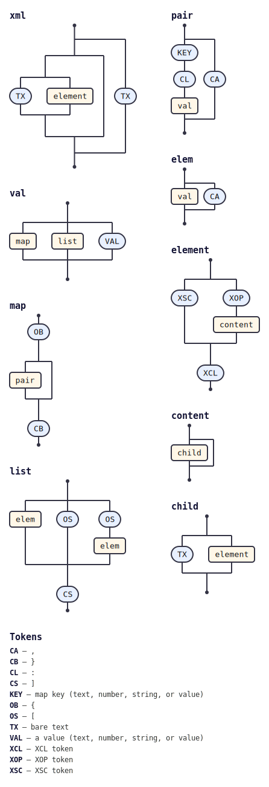

# @tabnas/xml

A [Jsonic](https://jsonic.senecajs.org) grammar plugin that parses XML
text into a tree of elements, with support for attributes, mixed content,
namespaces, entities, CDATA sections, comments, processing instructions,
and DOCTYPE declarations.

This is the TypeScript / JavaScript package. A Go port lives in
[`../go`](../go) (see [its README](../go/README.md)).

[](https://npmjs.com/package/@tabnas/xml)
[](https://github.com/tabnas/xml/actions/workflows/build.yml)

## Install

```sh
npm install @tabnas/parser @tabnas/jsonic @tabnas/xml
```

`@tabnas/parser` (the engine) and `@tabnas/jsonic` (the base grammar) are
peer dependencies.

## Example

```js
const { Tabnas } = require('@tabnas/parser')
const { jsonic } = require('@tabnas/jsonic')
const { Xml } = require('@tabnas/xml')

const xml = new Tabnas().use(jsonic).use(Xml)

xml.parse('<a>Tom &amp; Jerry</a>').children   // => ['Tom & Jerry']
```

The result is an `XmlElement` tree: each element has `name`, `localName`,
`attributes`, `children`, and — where they apply — `prefix`,
`namespace`, `space`, and `lang`.

## Documentation

Organised by the [Diátaxis](https://diataxis.fr) framework:

- [Tutorial](doc/tutorial.md) — a guided first parse.
- [How-to guide](doc/guide.md) — task recipes (options, errors, embed
  mode).
- [Reference](doc/reference.md) — the public API, every option, and the
  accepted XML syntax.
- [Concepts](doc/concepts.md) — how the parser works on the engine, and
  why.

## Grammar diagram

The installed grammar as a railroad/syntax diagram, generated from the
live grammar with
[`@tabnas/railroad`](https://github.com/tabnas/railroad):



A vertical ASCII version is in [`doc/grammar.txt`](doc/grammar.txt). The
grammar source lives in the repository's top-level `xml-grammar.jsonic`
and is embedded into [`src/xml.ts`](src/xml.ts) by `embed-grammar.js`
(run via `npm run build` or `npm run embed`).

## License

Copyright (c) Richard Rodger and other contributors,
[MIT License](LICENSE).
